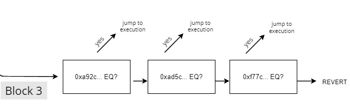

This project proves that ordering functions by use and then setting their method ids in ascending order wont necessarily result in a gas optimization.

In this [compiler code](https://github.com/ethereum/solidity/blob/0cb279494a9af0938dfbf2ca5d0b21115198e8bb/libsolidity/codegen/ContractCompiler.cpp#LL326C1-L388C2) we can see that in the function `appendInternalSelector()`the compiler checks if the number of methods is over 4. If there are more than 4 it selects the method id in the middle of the remaining methods as a **pivot**, sets a `GT` comparison with the _pivot_ and calls itself recursively with the parameters for the new separated blocks of method ids, one block being higher method ids than the _pivot_ and the other lower, therefore creating a binary search.

If the remaining method ids are `<= 4`, it just sets up a succession of `EQ` comparisons with the selectors in ascending order:



On the vault contract these are the method ids in ascending order:

```
"totalContributions()": "37c08923",
"TOTAL_CONTRIBUTION_CAP()": "4b03a338",
"requestAllowance(uint256)": "5b1164de",
"paused()": "5c975abb",
"deposit(uint72)": "626fb5b8",
"ALLOWANCE_CAP()": "84f9b1fc",
"withdraw(uint72)": "a92c4707"
"WETH()": "ad5c4648",
"controller()": "f77c4791",
```

When compiling the Vault contract with **the default 200 optimizer runs** and **100_000 optimizer runs** I got the the `Vault200Runs.asm` and the `Vault100_000Runs.asm` files in this repo, where you can see [the binary search algorithm in assembly.](https://github.com/0xArcturus/binarysearch/blob/40b4e8983d12b286fc56d7d484dc3ae8d1332943/Vault.asm#LL274C1-L344C13).

In both of them you can see that the contract implements a binary search, where the **100_000 runs** file has **two pivots** and is more optimized than the **200 runs** file, that implements only **one pivot**.

The following flowchart describes the execution of the most optimized assembly code:


All in all, as far as [Markus](https://github.com/MarkuSchick) and I have understood, arriving to execution for method Id 0xa92c4707 consumes less gas than arriving to execution for method Id 0x5b1164de.

**To our understanding, the gas cost is relative to the amount of pivots and the distance from each pivot.**
