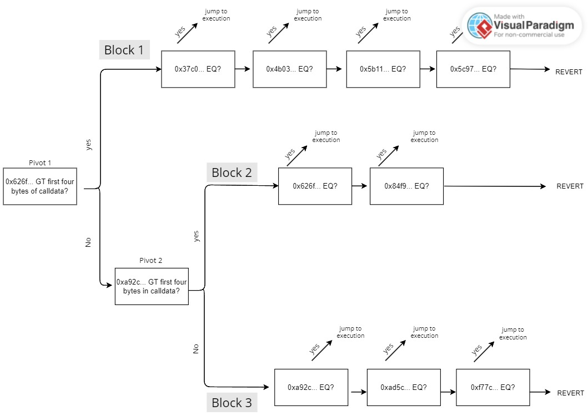

This project proves that the ordering method IDs from more used to least used doesn't certify that the gas cost is going to be lower.

In the [compiler code](https://github.com/ethereum/solidity/blob/0cb279494a9af0938dfbf2ca5d0b21115198e8bb/libsolidity/codegen/ContractCompiler.cpp#LL326C1-L388C2) we can see that the compiler checks if the number of methods is over 4. If there are more than 4 it selects the method id in the middle of the remaining methods as a pivot, sets a GT comparison with the pivot and calls itself recursively with the parameters for the new separated blocks, therefore creating a binary search.

If the remaining method ids are <= 4, it just sets up a succession of EQ comparisons with the selectors in ascending order.

On the vault contract these are the method ids in ascending order:

"totalContributions()": "37c08923",
"TOTAL_CONTRIBUTION_CAP()": "4b03a338",
"requestAllowance(uint256)": "5b1164de",
"paused()": "5c975abb",
"deposit(uint72)": "626fb5b8",
"ALLOWANCE_CAP()": "84f9b1fc",
"withdraw(uint72)": "a92c4707"  
"WETH()": "ad5c4648",
"controller()": "f77c4791",

When compiling the Vault contract with 100_000 optimizer runs I got the assembly block from lines 274 till 344, that describes the binary search algorithm to find the matching selector.

The following flowchart describes the assembly code:

All in all, as far as [Markus](https://github.com/MarkuSchick) and I have understood, arriving to execution for method Id 0xa92c4707 consumes less gas than arriving to execution for method Id 0x5b1164de
